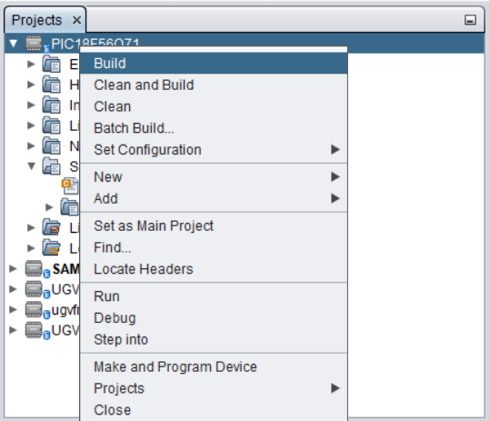
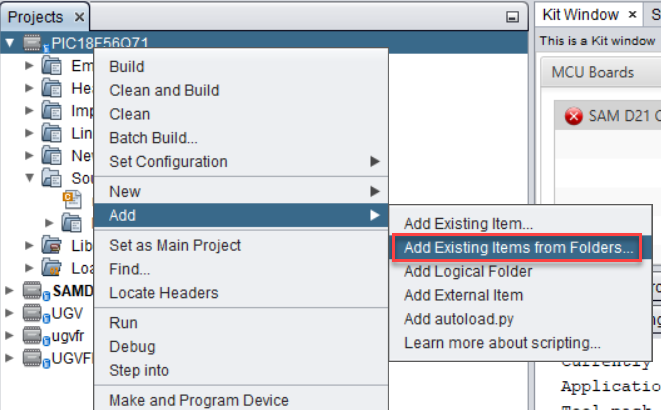
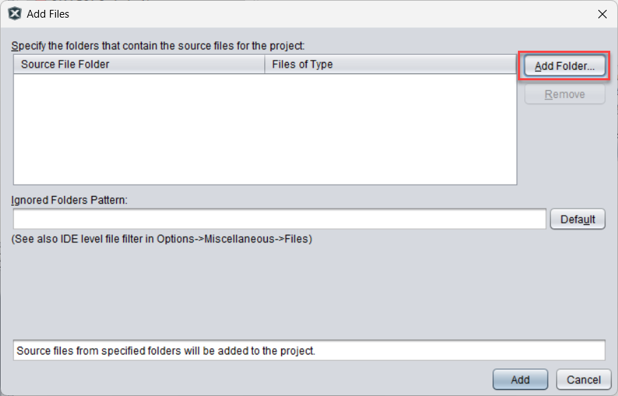
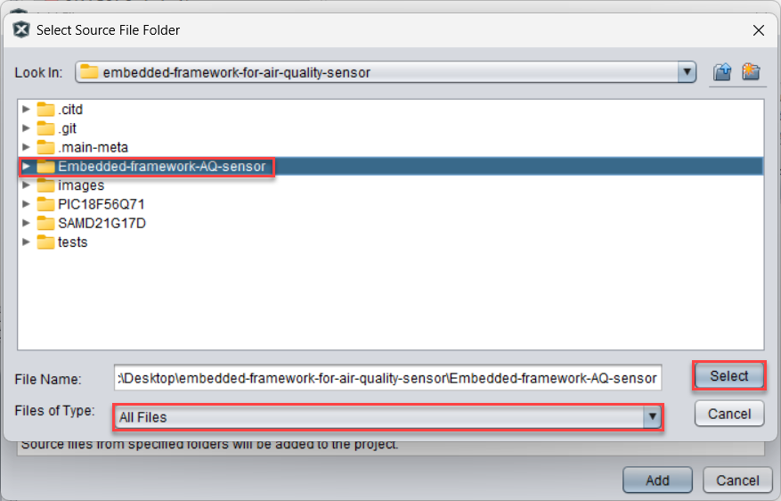
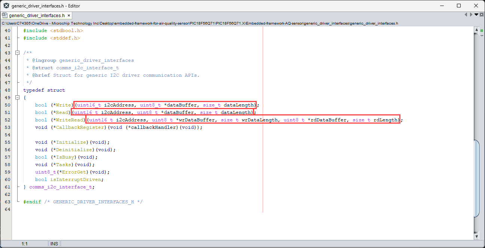
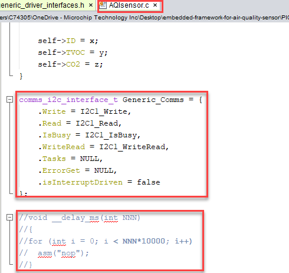
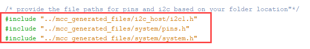
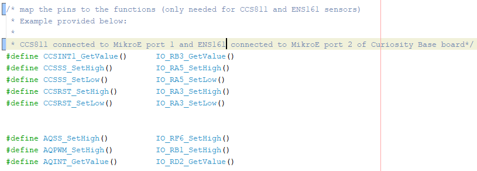

<!-- Please do not change this logo with link -->

<a target="_blank" href="https://www.microchip.com/" id="top-of-page">
   <picture>
      <source media="(prefers-color-scheme: light)" srcset="images/mchp_logo_light.png" width="350">
      <source media="(prefers-color-scheme: dark)" srcset="images/mchp_logo_dark.png" width="350">
      
   </picture>
</a>

# Embedded-framework-for-air-quality-sensor

This repository presents a generic embedded framework designed to simplify the integration and management of various air quality sensors in embedded systems. 

The primary goal is to provide a unified API that allows developers to interface with multiple sensor types such as: SGP30, SGP40, EN161, and CCS811 using the same set of functions and data structures.

## Hardware Used
- [SAM D21 CURIOSITY NANO EVALUATION KIT](https://www.microchip.com/en-us/development-tool/dm320119) or [PIC18F56Q71 CURIOSITY NANO EVALUATION KIT](https://www.microchip.com/en-us/development-tool/ev01g21a)
     - One of the core goals of this framework is to ensure it works on any Microchip (MCHP) microcontroller unit (MCU). The abstraction layers and hardware interface modules are designed to be portable across the entire Microchip MCU portfolio, making it easy to deploy your air quality monitoring solution on any MCHP device.
- [CURIOSITY NANO BASE FOR CLICK BOARDS](https://www.microchip.com/en-us/development-tool/ac164162)
- Supported Sensors:
     - [SGP30](https://sensirion.com/products/catalog/SGP30): A multi-pixel gas sensor for air quality monitoring from sensirion
     - [SGP40](https://sensirion.com/products/catalog/SGP40): A digital VOC sensor for indoor air quality applications from sensirion
     - [EN161](https://www.sciosense.com/wp-content/uploads/2024/12/ENS161-Datasheet.pdf): Air quality sensor from from ScioSense
     - [CCS811](https://download.mikroe.com/documents/datasheets/CCS811.pdf): A low-power digital gas sensor for monitoring indoor air quality from ScioSense

## Software Used
- MPLAB® X IDE 6.25.0 or newer [(MPLAB® X IDE 6.25.0)](https://www.microchip.com/en-us/development-tools-tools-and-software/mplab-x-ide)
- MPLAB® XC32 4.6.0 or newer compiler [(MPLAB® XC32 4.6.0)](https://www.microchip.com/en-us/tools-resources/develop/mplab-xc-compilers/xc32)
- MPLAB® XC8 3.10.0 or newer compiler [(MPLAB® XC8 3.10.0)](https://www.microchip.com/en-us/tools-resources/develop/mplab-xc-compilers/xc8)
- MPLAB® Code Configurator 5.6.2 or newer [(MCC v5.6.2)](https://www.microchip.com/en-us/tools-resources/configure/mplab-code-configurator)

## Related Documentation

The repository is organized to help quickly understand and implement the Embedded-framework-AQ-sensor in embedded projects. Here is how the structure supports the development:

- [Framework Folder](Embedded-framework-AQ-sensor):
     The main folder, Embedded-framework-AQ-sensor, contains a comprehensive [README file]((Embedded-framework-AQ-sensor/README.md)). This document explains the framework’s architecture, supported sensors, API usage, and integration steps. It is the primary resource for understanding how to use the framework with any supported sensor and Microchip MCU.

- Device Example Folders:

     - [PIC18F56Q71: Contains a complete example project demonstrating the framework running on a PIC18F56Q71 microcontroller](PIC18F56Q71)
     - [SAMD21G17D: Contains a complete example project for the SAMD21G17D microcontroller](SAMD21G17D)
     - Each folder includes a dedicated README file with step-by-step instructions for hardware setup, software configuration, and running the example ( [PIC18F56Q71 Readme](PIC18F56Q71/README.md) ; [SAMD21G17D Readme](SAMD21G17D/README.md) )

## Developing with Embedded Framework
1. Add the Embedded-framework-AQ-sensor to the project
     - Right click on the project  
     
     - Add Existing item from Folders 
     
     - Click on Add folder 
     
     - Select the Embedded-framework-AQ-sensor and select all file types. Click Select, then Add. 
     

2. Depending on the architecture of the Microcontroller the developer will have to change the following:  
     a.   generic_driver_interfaces.h:
     - Depending on the I2C functions, change the function parameter 
     

     b.   AQIsensor.c
     - Add the respective function names to the generic_comms interface
     - XC32 compiler doesn't support "__delay_ms", therefore in such cases create the function with same name and include the delay logic 
     

     c.   AQIsensor.h
     - Add I2C header file for I2C function calls, GPIO header file and the system header file  
     
     - Add respective GPIO pins based on where the external sensors are connected on the mikroE ports of the base board 
     
     - Add the delay function based upon the compiler

## Running the Example project
- To run the example project, navigate to the folder corresponding to the target device (PIC18F56Q71 or SAMD21G17D) 
- Each folder contains a README file with detailed instructions on hardware connections, software setup, and project execution 
- Follow the steps in the respective README documents to successfully build and run the air quality sensor framework example on the chosen Microchip MCU

