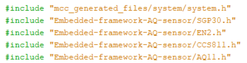
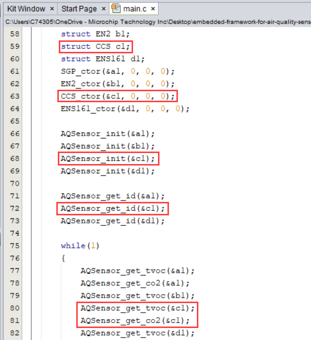
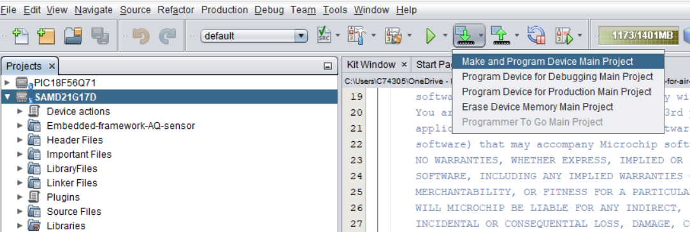
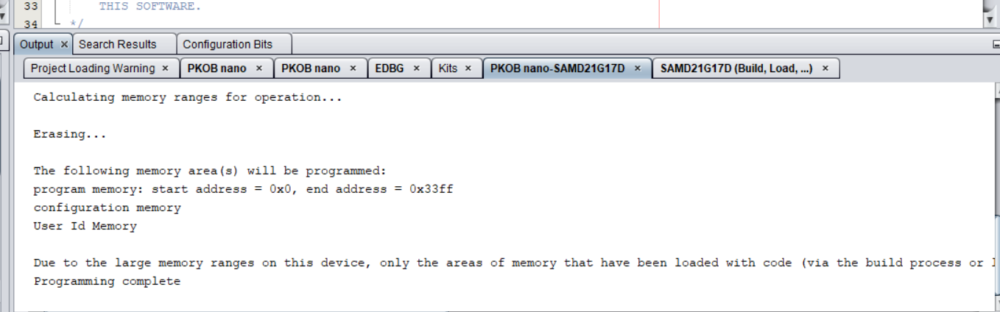
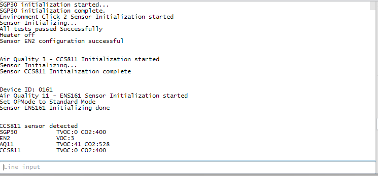

<!-- Please do not change this logo with link -->

<a target="_blank" href="https://www.microchip.com/" id="top-of-page">
   <picture>
      <source media="(prefers-color-scheme: light)" srcset="../images/mchp_logo_light.png" width="350">
      <source media="(prefers-color-scheme: dark)" srcset="../images/mchp_logo_dark.png" width="350">
      
   </picture>
</a>

# Embedded-framework-for-air-quality-sensor

## SAMD21G17D example

## Application Source Code
- Depending on which sensors in the framework are connected in the MikroE slot, the header file will need to be included  

- Next step is to call the sensor struct as shown below
- The constructor function needs to be called to use generic APIs
- The generic APIs can be used now, such as AQSensor_init,  AQSensor_get_id, AQSensor_get_tvoc, and AQSensor_get_co2  

## Running the Example project

- Open the SAMD21G17D.X project in MPLAB X IDE 

- Click on Make and program device Main Project  

- The status of programming should be seen in the output window 

- Serial terminal output is shown below: (Baud rate 115200)  

## Conclusion
By using the Embedded-framework-AQ-sensor, the developer is able to program the application with generic air quality sensor APIs, regardless of the specific sensor model (SGP30, SGP40, EN161, CCS811) or Microchip MCU in use. This approach significantly reduces development time and complexity, as the application code remains unchanged when switching or adding sensors. The framework’s object-oriented design ensures scalability, maintainability, and ease of integration for future sensor support. With this solution, developers can focus on building robust air quality monitoring applications without being concerned about low-level sensor differences or hardware dependencies.
